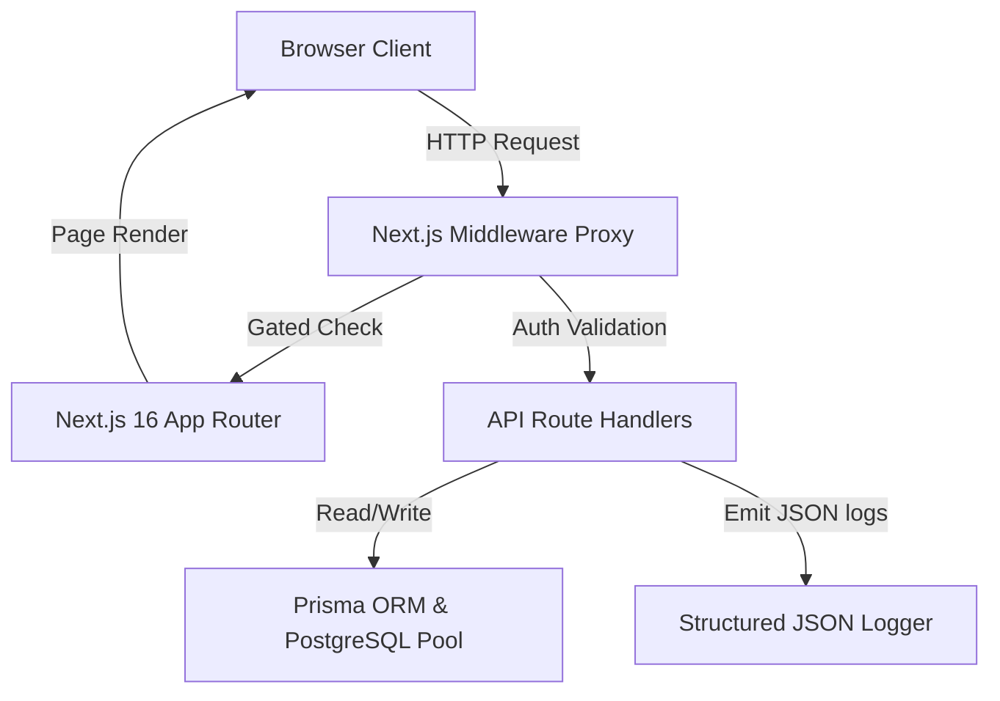

# Drivly System Architecture

This document describes the high-level system architecture, data flow, and components of the Drivly peer-to-peer gated society vehicle sharing platform.

---

## 🏛️ High-Level Component Layout

---

## 🔄 Core Architectural Blocks

### 1. Request Interception & Routing (Next.js Middleware Proxy)
All incoming web requests pass through the Next.js Middleware Proxy in [src/proxy.ts](file:///Users/prajwaljanbandhu/Desktop/IDEAS/src/proxy.ts).
* It extracts JWT session signatures (`user_session` cookie).
* If signatures verify successfully using the environment secret key, the claims (userId, role, society) are parsed.
* The proxy gates access dynamically, sending unauthenticated users to `/login`, and redirecting users depending on their society membership headers.

### 2. Gated API Layer
The API handlers in `src/app/api/` enforce trust boundaries:
* All requests are validated against strict Zod parsing schemas ([src/lib/validations.ts](file:///Users/prajwaljanbandhu/Desktop/IDEAS/src/lib/validations.ts)).
* The logic enforces society boundaries: renters are restricted to searching and requesting vehicle listings listed in their own gated society.
* Owner actions (approving, rejecting, logging traffic challans) are gated by verifying that the active session matches the vehicle's `ownerId`.

### 3. Database Layer (Prisma ORM & PostgreSQL Connection Pool)
* Connection pooling is implemented in [src/lib/db.ts](file:///Users/prajwaljanbandhu/Desktop/IDEAS/src/lib/db.ts) using the native `pg` driver and `PrismaPg` adapter, optimizing connection recycling in serverless deployment targets.
* Custom database extensions are configured using flat schemas ([prisma/schema.prisma](file:///Users/prajwaljanbandhu/Desktop/IDEAS/prisma/schema.prisma)).

### 4. Observability & Auditing Layer
* Central logger utility in [src/lib/logger.ts](file:///Users/prajwaljanbandhu/Desktop/IDEAS/src/lib/logger.ts) serializes operations (logins, bookings, listings) into auditable JSON logs.
* Standardized error response factory in [src/lib/errors.ts](file:///Users/prajwaljanbandhu/Desktop/IDEAS/src/lib/errors.ts) formats all API errors uniformly.
