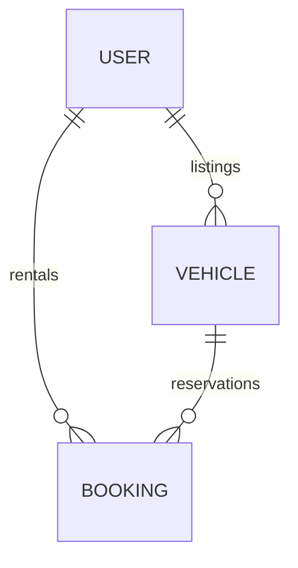

# Drivly Database Schema Document

This document explains the database models and column layouts defined in [prisma/schema.prisma](file:///Users/prajwaljanbandhu/Desktop/IDEAS/prisma/schema.prisma) for PostgreSQL.

---

## 🗄️ Database Entity Models

### 1. `User` Model
Represents verified renters, owners, or both.
* `id` (String, Primary Key): Unique uuid.
* `name`, `email`, `phone` (String): Basic user contact details.
* `city`, `societyName` (String): Location markers.
* `role` (Enum: `OWNER`, `RENTER`, `BOTH`): Security role claims.
* `password` (String): Hashed password.
* `preVerifyDl` (Boolean), `dlFileName` (String): Driving License checks.

### 2. `Vehicle` Model
Represents listings added by owners.
* `id` (String, Primary Key): Unique uuid.
* `ownerId` (String): Foreign key referencing `User`.
* `type` (Enum: `CAR`, `BIKE`): Vehicle type classification.
* `brand`, `model`, `colorHex` (String): Styling details.
* `year`, `pricePerHour` (Float): Metadata parameters.
* `available` (Boolean): Access toggle.

### 3. `Booking` Model
Tracks rentals, security deposits, mutual ratings, and violations.
* `id` (String, Primary Key): Unique uuid.
* `renterId` (String): Foreign key referencing `User` (renter).
* `vehicleId` (String): Foreign key referencing `Vehicle`.
* `startTime`, `endTime` (DateTime): Date bounds.
* `status` (Enum: `PENDING`, `APPROVED`, `REJECTED`, `ACTIVE`, `COMPLETED`, `CANCELLED`): Booking state.
* `totalCost` (Float): Price billing.
* `odometerStart`, `odometerEnd` (Int): Mileage tracker.

#### Phase 3 Payments & Deposits Extensions:
* `paymentStatus` (Enum: `NONE`, `HELD`, `PAID`, `REFUNDED`): Sandbox deposit payment state.
* `depositAmount`, `refundAmount` (Float): Cash values.
* `challanPenalty` (Float), `challanReason` (String), `challanStatus` (Enum: `NONE`, `PENDING`, `DEDUCTED`): Violation logs.
* `ownerRating` (Int), `ownerReview` (String): Renter review of the owner.
* `renterRating` (Int), `renterReview` (String): Owner review of the renter.
